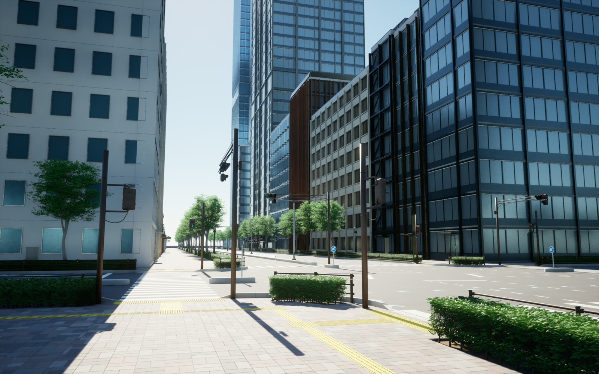
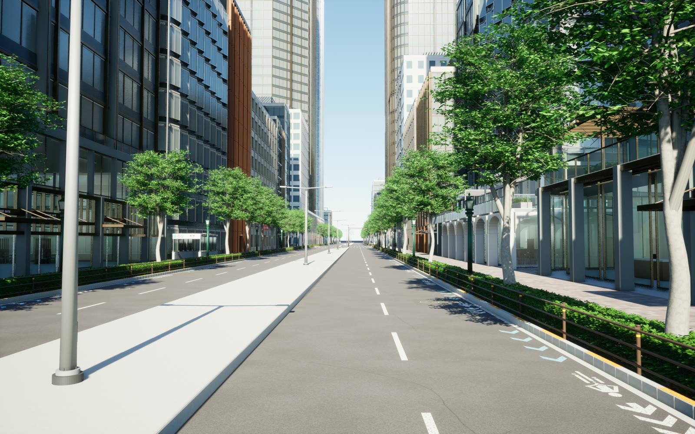
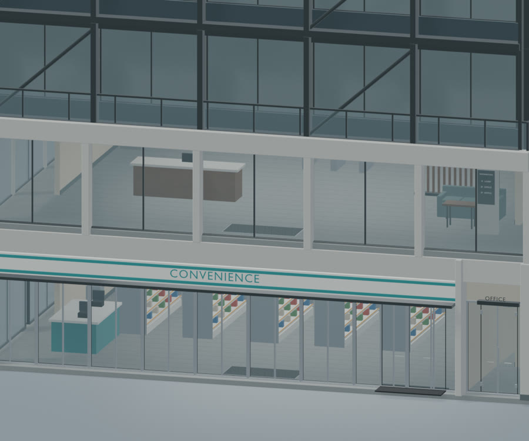
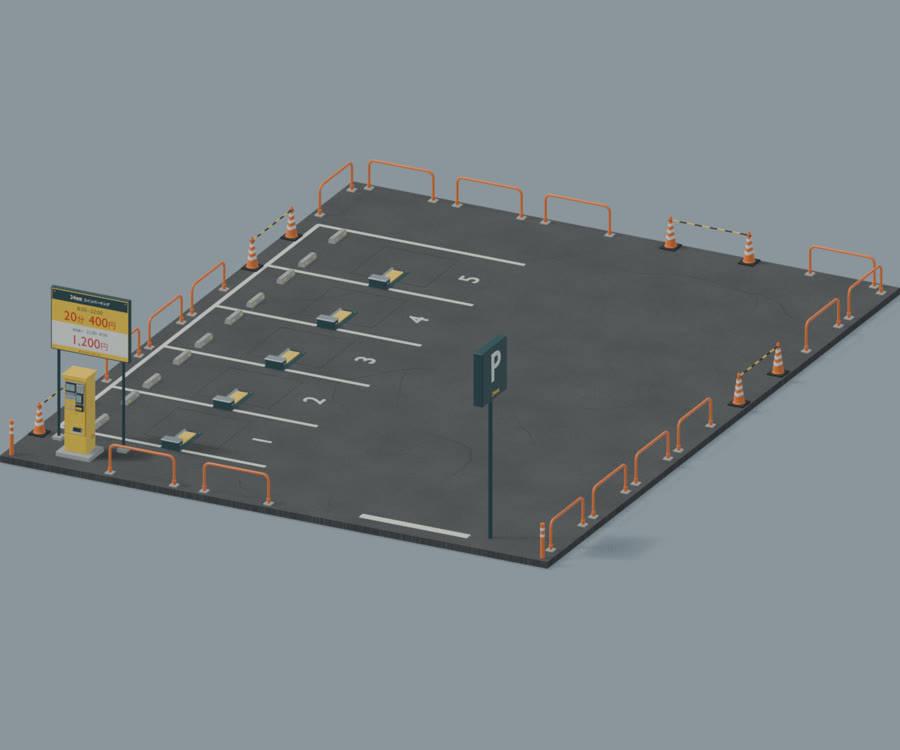
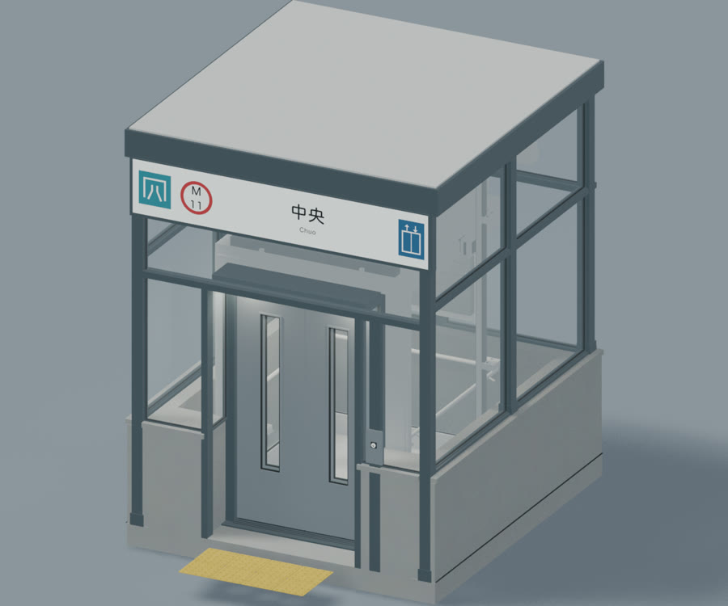

# Agent-Centric Japanese City Generator

[日本語](README.ja.md)

A generator for Japanese-style cities, designed to be operated by coding agents.
Its focus is Japanese roads and intersections, with detailed geometry and roadside equipment: lanes, road markings, traffic signals, signs, sidewalks, tactile paving, and street trees.
Buildings, surface parking, and subway entrances are placed along the road network to create city scenes in Blender.



## Build a city with an agent

Describe a city to your coding agent, such as a 200 m square area with an avenue, local roads, and an unsignalized intersection.
The agent edits a request JSON and uses a shared CLI to plan, validate, and build the scene.
The generator handles road constraints and building placement, so each scene does not require new modeling code.

**Natural-language request → agent-authored JSON → placement plan and SVG map → Blender city scene**

Geometry, materials, and textures are generated from code; no external model or image assets are required.
Japanese lettering uses a font supplied by the user. See [dependencies and licensing](docs/PROVENANCE.md).
The modeling and generation code was developed through conversations with Codex.
Usage is agent-independent: any coding agent that can edit JSON and run CLI commands can operate the generator.

## Quick start

Requirements: Python 3.10+, Node.js 18+, and Blender 4.5 LTS.
Tested on macOS. Executable paths are configurable for other systems, but those systems have not been tested.
Normal use requires no npm installation, GUI server, or LLM API key.

```sh
# Supply a Japanese font with suitable usage permissions.
export CITY_FONT=/absolute/path/to/JapaneseFont.ttf
# Set this if Blender is not at the default macOS path.
export BLENDER_BIN=/absolute/path/to/blender

python3 city.py capabilities
python3 city.py plan examples/city/central_200.json --output scenes/demo/plan.json
python3 city.py preview scenes/demo/plan.json --output scenes/demo/output
```

Outputs include `scenes/demo/output/city.blend`, `overview.png`, and `street.png`.
Use `build` instead of `preview` to skip images. Matching plans and file hashes allow an existing Blend to be reused.
Use a different output directory or explicitly pass `--replace` when building a different plan into the same directory.

## Top-down maps

`plan` also writes an SVG map showing roads, sidewalks, building sites and floor counts, parking, subway entrances, and signal control.
Export a map from a saved plan using Python alone:

```sh
python3 city.py map scenes/demo/plan.json --output scenes/demo/map.svg
```

Open the SVG in a browser to zoom in. It is a scaled layout diagram, not a roof-outline or road-marking drawing.

## Example agent prompt

> Follow docs/AGENT_WORKFLOW.md to create a city.
> Use a 200 m square area with one central avenue carrying two lanes in each direction and several roads carrying one lane in each direction.
> Include one unsignalized four-way intersection and a mix of towers and tenant buildings.
> Keep the shared library unchanged and save the request and outputs under scenes/my_city.

The agent edits the request JSON. A dedicated natural-language model is not bundled.

## City features

- Straight and curved roads, four-way and T intersections, signalized and unsignalized junctions, one to three lanes per direction, medians, sidewalks, and roadside equipment.
- 26 building prototypes, including 16 seed-driven families with configurable dimensions, plans, facades, lower floors, and roofs.
- Roadside placement, occupancy and site-fit checks, parking driveway cutouts, and paving connections along curves.
- Stair and elevator subway entrances, surface parking, trees, shrubs, traffic signals, and signs.
- Saved plans and design values, numerical checks, EEVEE previews, and generation-time and file-size reports.



Automatic placement uses conservative rectangular site envelopes. Counts and shape ratios are targets; actual results and warnings are reported.
Terrain elevation and adapting buildings to irregular plots are not supported. The generator does not certify building-code or road-design compliance.

## Asset library

| Ground-floor interiors | Surface parking | Subway entrance |
|:---:|:---:|:---:|
| [](media/building_store_detail.jpg) | [](media/parking.jpg) | [](media/subway_elevator.jpg) |
| [Buildings](asset_library/building/README.md) | [Surface parking](asset_library/coin_parking/README.md) | [Subway entrances](asset_library/subway_entrance/README.md) |

Each asset README documents its parameters, dimensions, origin, and generation methods.

| Asset | Contents |
|---|---|
| [Buildings](asset_library/building/README.md) | Towers, tenant buildings, lower-floor interiors, underground parking entrances |
| [Surface parking](asset_library/coin_parking/README.md) | Bays, locking flaps, payment machines, signs, and fences |
| [Subway entrances](asset_library/subway_entrance/README.md) | Stairs, elevators, station names, and route labels |
| [Vehicle signals](asset_library/traffic_signal/README.md) | Main aspects, arrow blocks, and supports |
| [Pedestrian signals](asset_library/pedestrian_signal/README.md) | Pedestrian figures, countdowns, and supports |
| [Road signs](asset_library/road_sign/README.md) | Sign faces and poles |
| [Road markings](asset_library/road_marking/README.md) | Bicycle-lane markings and direction arrows |
| [Pedestrian fences](asset_library/guardrail/README.md) | Tubular sidewalk fences |
| [Reflector poles](asset_library/reflector_pole/README.md) | Flexible delineators with reflective bands |
| [Traffic mirrors](asset_library/curve_mirror/README.md) | Single and double convex mirrors |
| [Warning lamps](asset_library/dual_warning_lamp/README.md) | Vertical amber warning lamps |
| [Street lights](asset_library/street_light/README.md) | Roadway and pedestrian lights |
| [Street trees](asset_library/street_tree/README.md) | Deciduous trees with configurable form and variation |
| [Planting](asset_library/planting/README.md) | Shrubs and clipped hedges |
| [Hydrant covers](asset_library/fire_hydrant_cover/README.md) | Rectangular cast-iron covers |
| [Hydrant signs](asset_library/fire_hydrant_sign/README.md) | Hydrant location signs |
| [Street utilities](asset_library/street_utilities/README.md) | Drains, service covers, and control cabinets |

[Shared components](asset_library/shared/README.md) provide pavement, metal, foliage, and font utilities.

## Examples and documentation

- `examples/city/central_200.json`: a 200 m square area with an avenue, local roads, and an unsignalized intersection.
- `examples/city/avenue_500.json`: a 500 m road, 29 buildings, two parking lots, and both subway entrance variants.
- `examples/city/avenue_360.json`: underground parking, surface parking, and both subway entrance variants.
- `examples/city/curved_300.json`: a gentle curve with roadside buildings.
- [Agent workflow](docs/AGENT_WORKFLOW.md)
- [Request and plan format](docs/SCENE_FORMAT.md)
- [Tool interface and cost](docs/TOOL_DESIGN.md)
- [Validation](docs/VALIDATION.md)

## Development

This section is for modifying the generator itself. To create scenes, edit request JSON and run `city.py`.

Road planning, geometry calculations, and constraints are implemented in four TypeScript files under `road_authoring/src/`.
Node.js executes their compiled JavaScript in `city_generator/road_runtime/`.
The compiled files are bundled, so normal use does not require TypeScript or compilation.
Source hashes detect mismatches between the source and the compiled runtime.

After editing `road_authoring/src/`, set `CITY_TSC` to a TypeScript compiler executable and rebuild the runtime.
The script uses the TypeScript 7 `--ignoreConfig` option and has been tested with 7.0.2.

```sh
CITY_TSC=/path/to/tsc node city_generator/compile_roads.mjs
```

Run the planning and road tests after changes. These commands do not render images in Blender.

```sh
python3 -m unittest discover -s city_generator/tests -v
python3 -m unittest discover -s road_generator/tests -v
```

## Promotional images

The city images above show generated Blender scenes rendered in Unreal Engine.
The asset close-ups are rendered in Blender EEVEE.
This repository provides city-scene generation in Blender; the Unreal Engine rendering workflow is not included.

## License

The code is released under the [MIT License](LICENSE).
Fonts and dependencies retain their own licenses. See [dependencies and licensing](docs/PROVENANCE.md).
